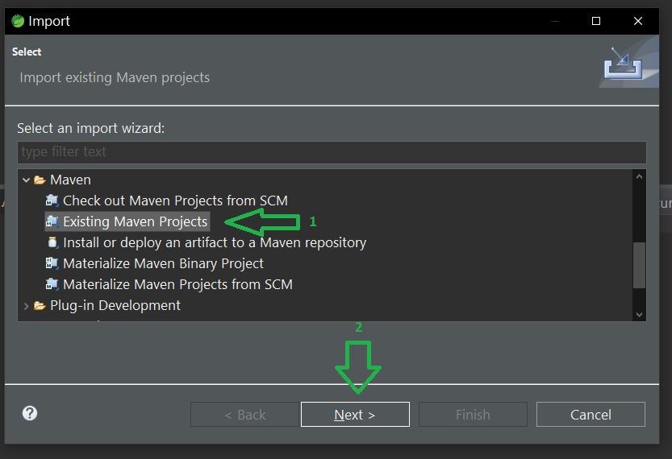
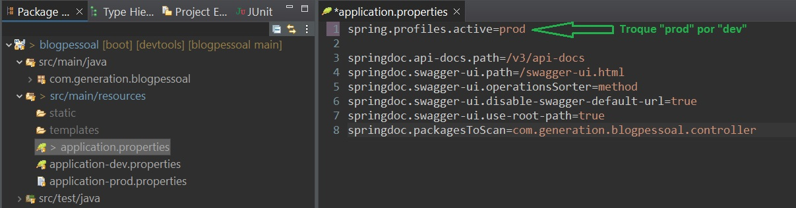
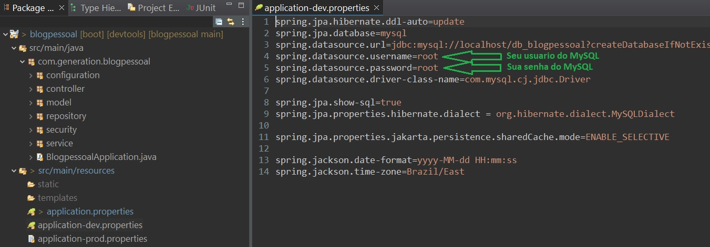
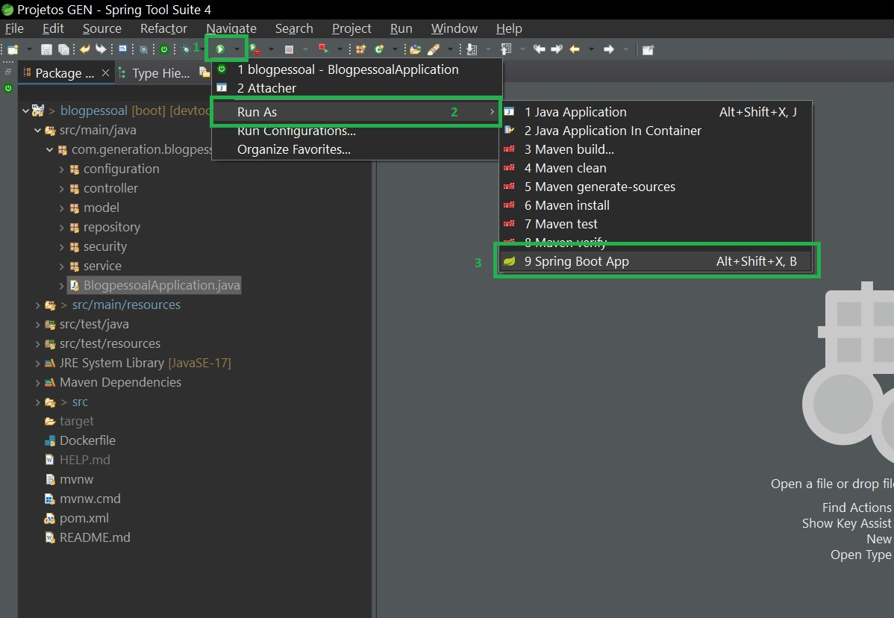
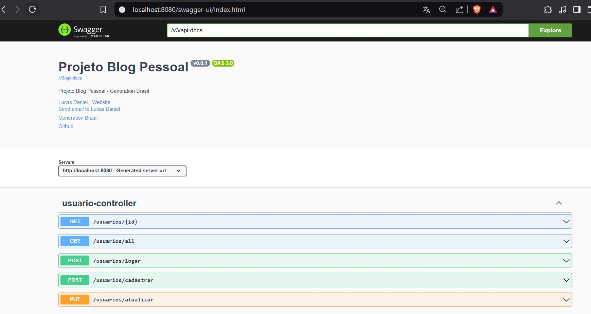

# Implementando um CRUD completo em Java com Spring Boot

Este projeto implementa um CRUD completo utilizando Java e Spring Boot, incluindo relacionamento entre entidades e configuração de segurança com Spring Security e JWT.

## Testando a aplicação

### A aplicação possui um deploy e está documentada no Swagger. Para acessá-la e testar seus endpoints, basta acessar o seguinte endereço: [Deploy da aplicação](https://blogpessoal-schf.onrender.com)

### Ou 

## Teste na sua máquina <a href="#testar">Instruções</a>

## Tecnologias utilizadas

- Java 17
- Spring Boot
- Spring Security
- JSON Web Tokens (JWT)
- Hibernate
- PostgreSQL
- Maven
- Swagger

## 🛠 Principais pontos abordados no projeto

✔️ Estruturação de entidades no banco de dados com JPA e validações. 
✔️ Configuração de autenticação e autorização utilizando Spring Security e JWT. 
✔️ Desenvolvimento de endpoints RESTful com métodos HTTP (GET, POST, PUT, DELETE). 
✔️ Implementação de relacionamento OneToMany entre as entidades. 
✔️ Criação de um serviço de autenticação para proteger rotas e garantir acesso seguro aos recursos.  

Além disso, o projeto seguiu boas práticas, como o uso de injeção de dependências (@Autowired), DTOs para login e senha e validação de dados de entrada com Bean Validation.

🎯 Foi uma experiência incrível que me ajudou a consolidar o aprendizado e expandir meus conhecimentos no desenvolvimento de APIs seguras e eficientes.

## 
Instruções para rodar na sua máquina

1. Certifique-se de ter o Java 17+ instalado e o MySQL Workbench configurado. 
2. Baixe a aplicação no seu computador através do repositório: [GitHub](https://github.com/Lucas300/blogpessoal_spring.git) ou baixe o arquivo compactado e extraia-o para o local de sua preferência. 
3. Abra o projeto na sua IDE de preferência. 
4. Importe o projeto como "Existing Maven Projects". 

### Exemplo usando o Spring Tools/Eclipse:
 

5. Aguarde até que a IDE baixe todas as dependências do projeto. 
6. Verifique se o perfil ativo da aplicação está definido como "dev": 
 

7. No arquivo `application-dev.properties`, verifique e ajuste seu usuário e senha do MySQL, se necessário: 
 

8. Execute a aplicação: 

### Exemplo usando o Spring Tools/Eclipse:
 

9. Acesse a aplicação através do navegador no endereço: [http://localhost:8080/](http://localhost:8080/)

### Agora você já pode explorar a API documentada com Swagger:
 

# 🛠 Front-end in progress... [https://github.com/Lucas300/portifolioReact.git](https://github.com/Lucas300/portifolioReact)